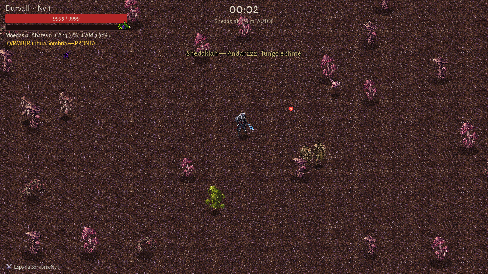

# EVID-047 — Integridade visual dos inimigos repetidos

Data: 2026-09-27  
SPEC: `SPEC-038-integridade-visual-dos-inimigos.md`

## Resultado

O checkout atual já preenche `EnemyView.tex` após a consulta a `_tex_cache`,
independentemente de o recurso já estar carregado. A hipótese de que um acerto
de cache deixaria a segunda instância sem textura foi refutada pelo teste de
regressão e pela captura de viewport; não houve alteração no consumidor.

O teste ampliado percorre os 49 IDs de `data/enemies.json`. Para cada PNG ele
verifica existência, importação Godot, decodificação, canal alfa e conteúdo
visível. Para os 47 IDs sem folhas animadas, o teste limpa o cache, instancia
dois `EnemyView` e exige uma textura válida e compartilhada nas duas instâncias.

## Verificação

1. `Godot_v4.7.2-stable_win64.exe --headless --path . -s tests/run_all.gd`
   terminou com `testes: 0 falha(s)`.
2. `Godot_v4.7.2-stable_win64.exe --headless --path . res://tools/smoke.tscn`
   terminou com `smoke: ok`; Dagruve, Docas e as sete fases seguintes ficaram
   no estado `running` com inimigos presentes.
3. `Godot_v4.7.2-stable_win64.exe --path . res://tools/shot.tscn --
   .atena/evidence/enemy-static-cache-qa-2026-09-27.png 3 run shedaklah
   durvall god` produziu a captura de 1280×720 abaixo. Shedaklah começa com
   instâncias repetidas de inimigos estáticos; nenhuma aparece como o fallback
   vermelho.

## Limites e exceções

- O projeto não possui `.game-dev/adapter.json`; portanto esta é evidência
  local de teste e viewport, não uma captura selada nem uma medição de GPU.
- Os processos headless emitiram os avisos conhecidos para `user://logs`,
  certificados-raiz do Windows e objetos mantidos ao encerramento. Nenhum
  causou falha de teste, smoke ou importação de asset.
- Não houve mudança em `ui/enemy_view.gd`, PNGs, dados, lore, dependências,
  publicação ou serviços externos. A diferenciação artística entre os dois
  Molydeus continua pendente de uma decisão humana separada.

## Reconciliação de aceite

| Critério | Resultado |
| --- | --- |
| Instâncias estáticas repetidas não usam fallback | Aprovado pelo teste das 47 instâncias estáticas e captura de QA. |
| 49 IDs resolvem para PNG importável | Aprovado pelo teste data-driven. |
| Animações de Zumbi e Sacerdote preservadas | Aprovado pela auditoria existente de tiras e pela suíte completa. |
| Suíte e smoke passam | Aprovado. |
| Leitura em 1280×720 | Aprovado pela captura exploratória local. |
| Sem alteração fora do escopo | Aprovado pela revisão dos arquivos alterados. |
