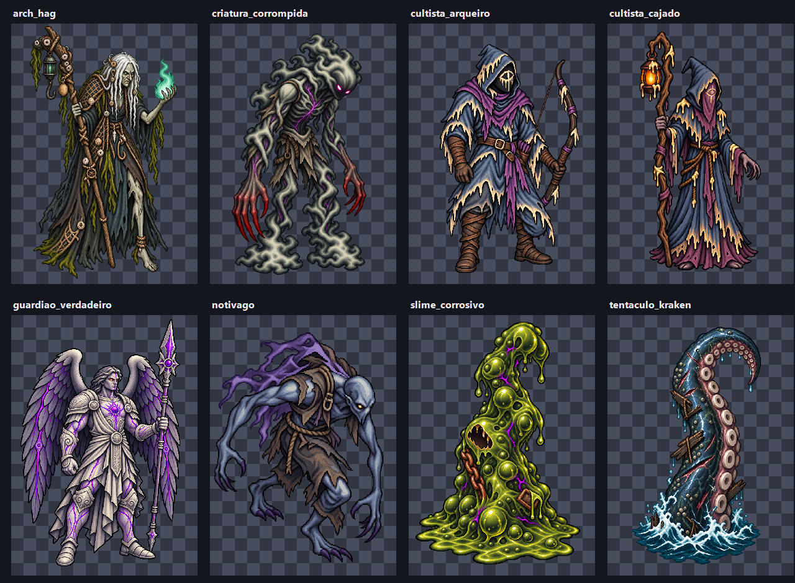

# EVID-127 — Gate de identidade da Onda 1

## Escopo verificado

Foram gerados os oito `idle_00` previstos para o gate de identidade. Todos
permanecem em `.atena/generated/art-candidates/enemies-wave-1/`; não houve
modificação em `assets/`, código ou dados do jogo.

## Prancha de revisão

## Checagens objetivas

| Candidata | Dimensão bruta | Alfa nos cantos | Solidez | Alfa médio |
|---|---:|---:|---:|---:|
| `slime_corrosivo` | 1024×1536 | 0 | 0,977 | 0,976 |
| `cultista_arqueiro` | 1024×1536 | 0 | 0,967 | 0,971 |
| `cultista_cajado` | 1024×1536 | 0 | 0,968 | 0,972 |
| `notivago` | 1024×1536 | 0 | 0,964 | 0,968 |
| `criatura_corrompida` | 1024×1536 | 0 | 0,951 | 0,959 |
| `arch_hag` | 1024×1536 | 0 | 0,950 | 0,960 |
| `tentaculo_kraken` | 1024×1536 | 0 | 0,971 | 0,974 |
| `guardiao_verdadeiro` | 1024×1536 | 0 | 0,977 | 0,976 |

As oito imagens superam a meta de solidez de 0,90 e têm transparência real nos
cantos. Dimensões de runtime ainda não foram aplicadas; isso pertence à futura
admissão e integração.

## Decisão do dono

Em 2026-09-30, o dono aprovou todas as oito identidades da prancha. A aprovação
cobre I01–I08 como referências para gerar os ciclos; não aprova ainda os quadros
de animação nem autoriza admissão no runtime. O Lote A pode prosseguir.
