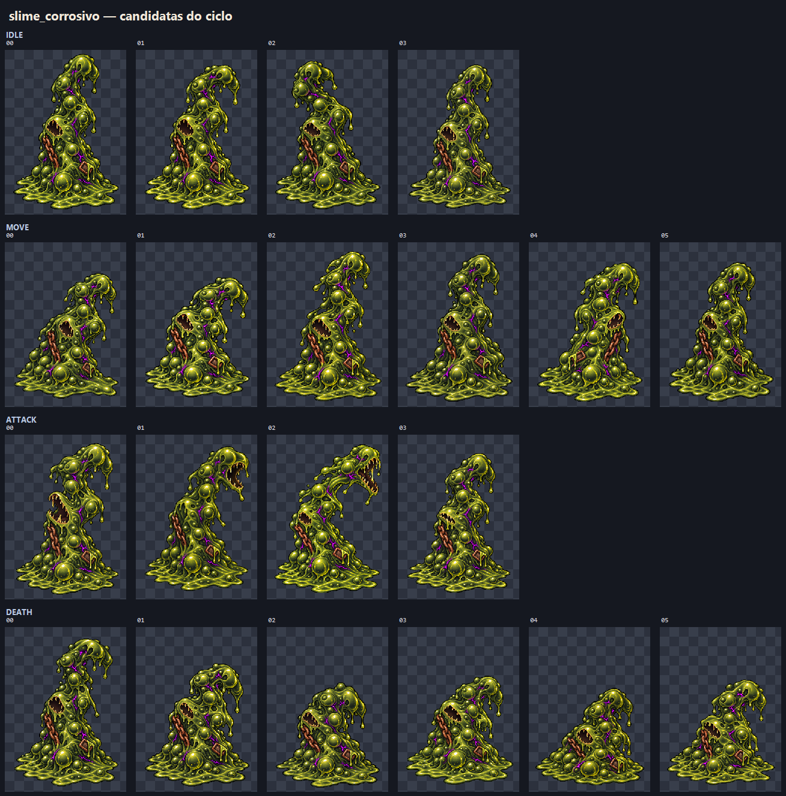
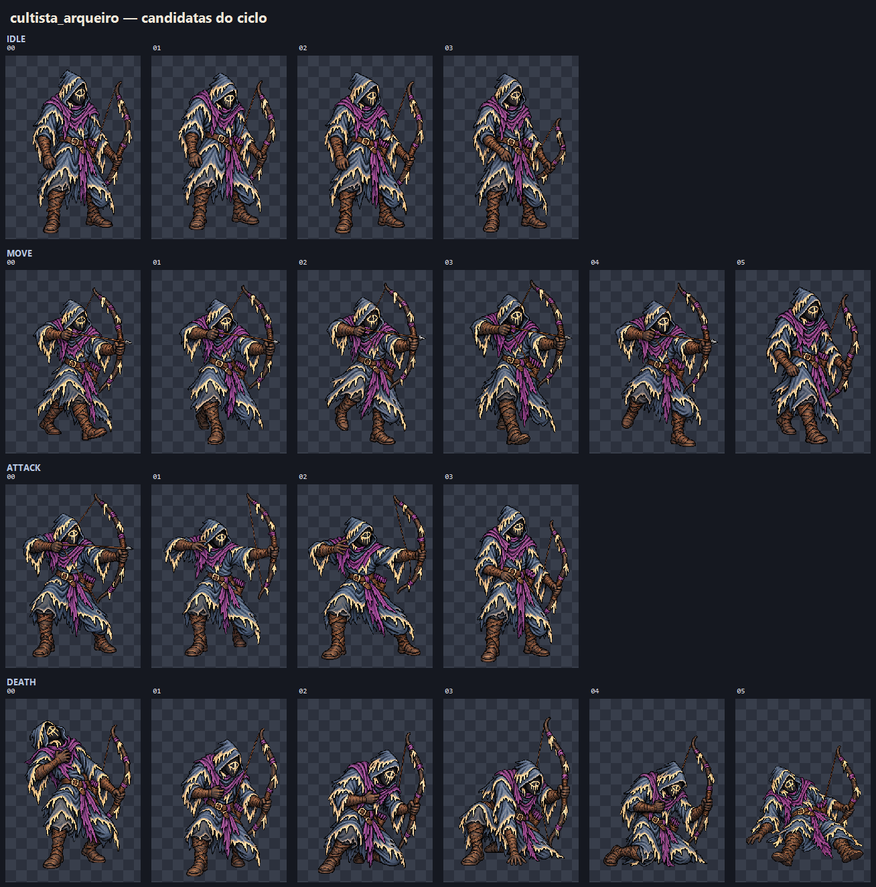
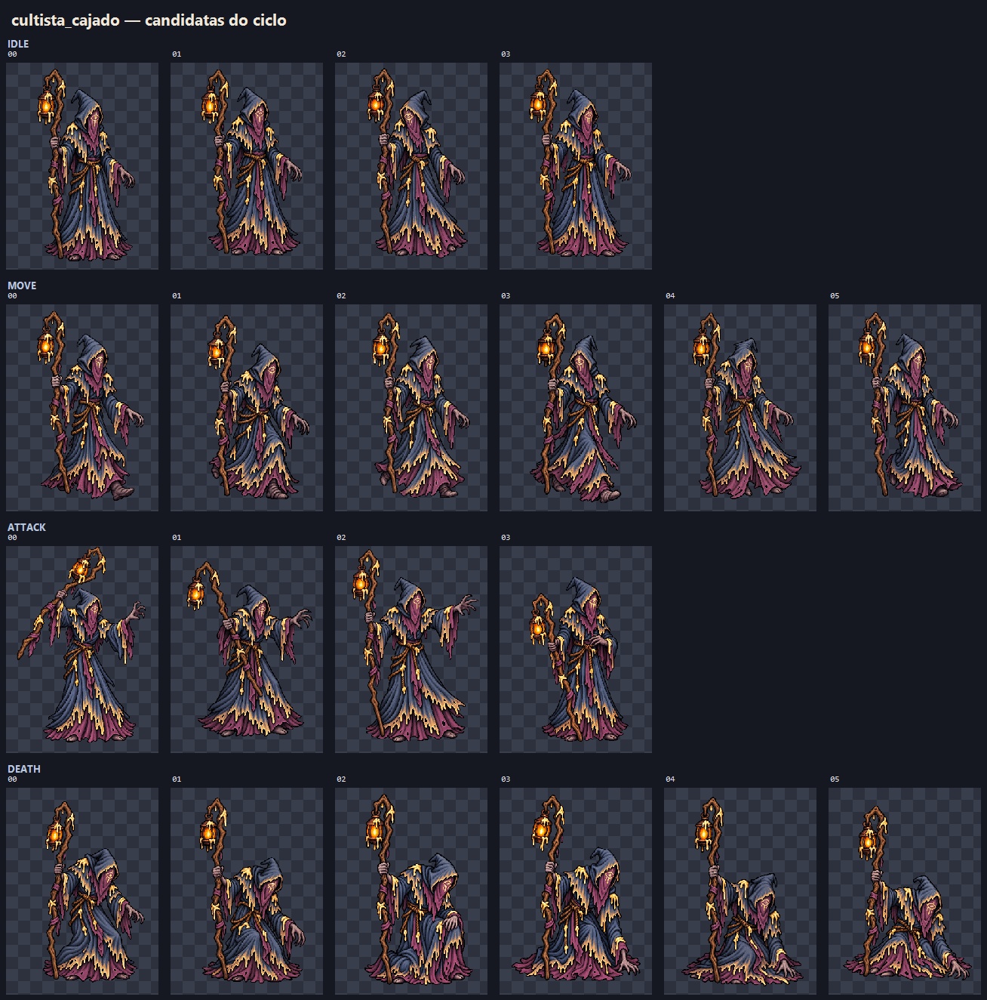
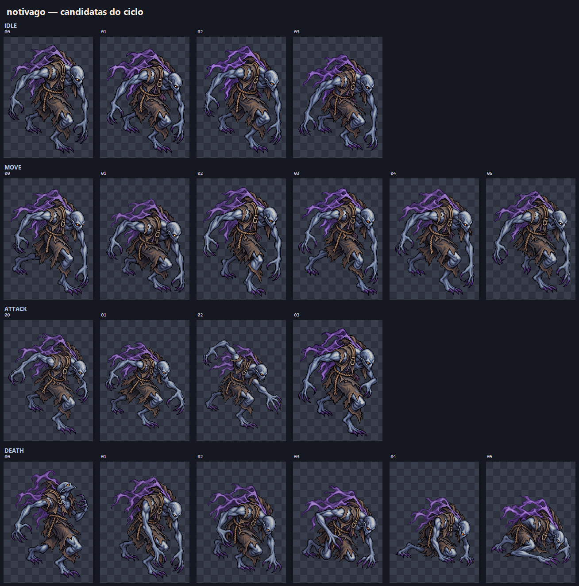

# EVID-128 — Lote A de animações

## Entrega

Foram completados 80 quadros candidatos para os quatro mobs de Dagruve. Cada
ciclo tem 4 idle, 6 move, 4 attack e 6 death. Os quadros estão em células PNG
RGBA de 256×384 e permanecem em `.atena/generated/art-candidates/`.

## Pranchas por mob

### Slime corrosivo

### Cultista arqueiro

### Cultista de cajado

### Notívago

## QA realizado

- 20 células selecionadas por mob: 80 quadros no total.
- Dimensões: 256×384 em todos os 80 quadros; PNG com canal alfa.
- Auditoria de opacidade: pior resultado observado **0,942 sólido**, acima do
  mínimo 0,90 do plano.
- Células redimensionadas por nearest-neighbor a partir da geração 1024×1536,
  mantendo transparência e sem esticar os sprites.
- Duas candidatas foram preservadas como substituídas: `cultista_arqueiro_idle_02`
  (v01 desenhava o arco, substituída por pose relaxada v02) e
  `slime_corrosivo_move_03` (v01 deslocava a boca para o lado oposto,
  substituída por uma pose que preserva a orientação em v02). As versões v02
  aparecem nas pranchas e no manifesto como selecionadas.
- Manifesto e contagem conferidos: 20 quadros por alvo e 80 no lote.

## Decisão do dono

Em 2026-09-30, o dono aprovou integralmente os ciclos de `slime_corrosivo`,
`cultista_arqueiro`, `cultista_cajado` e `notivago`. Os 80 quadros ficam elegíveis
para uma futura proposta de admissão, mas ainda não foram integrados no runtime.
Com essa aprovação, o plano avança para o Lote B: `criatura_corrompida` e
`arch_hag`.
