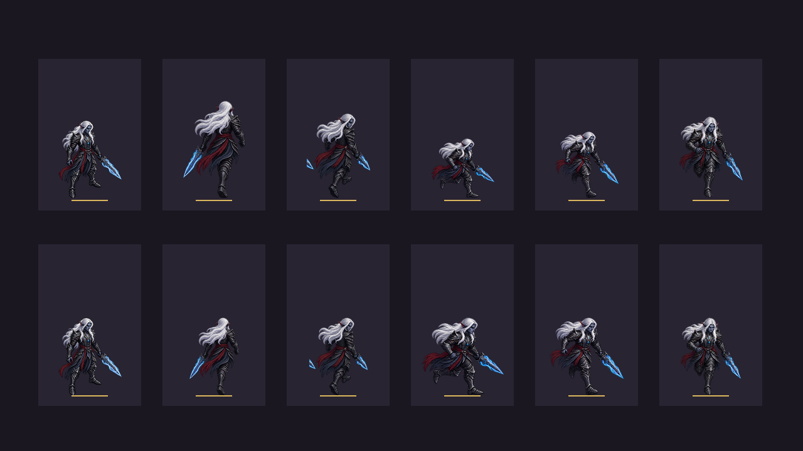

# EVID-129 — Auditoria e piloto de proporções no movimento dos heróis

Data: 2026-09-30  
SPEC: `SPEC-101-polimento-proporcoes-movimento-herois.md`

## Contrato conferido

`ui/hero_view.gd` escolhe oito direções lógicas. As folhas-fonte são
`move_n`, `move_ne`, `move_e`, `move_se` e `move_s`; runtime espelha as três
direções opostas. Todas as dez pastas de heróis contêm `idle` e essas cinco
folhas-fonte. Assim, o runtime cobre todos os lados, embora oeste, noroeste e
sudoeste não usem arte independente sob o contrato atual (há arquivos legados
para alguns heróis, mas o runtime não os carrega).

## Auditoria de escala aparente

O medidor percorreu os quadros com alfa ≥ 0,10 e calculou a caixa visível de
cada célula. A tabela compara a menor e a maior altura mediana entre as cinco
direções-fonte do herói.

| Herói | Menor–maior mediana (px) | Razão | Variação da base entre direções (px de fonte) |
|---|---:|---:|---:|
| Durvall | 226–368 | 1,63× | 0 |
| Brook | 245–360 | 1,47× | 0 |
| Maelor | 302–369 | 1,22× | 16 |
| Nyrelia | 298–352 | 1,18× | 0 |
| Bromnor | 251–290 | 1,16× | 24 |
| Leoric | 215–244 | 1,13× | 0 |
| Kayron | 327–363 | 1,11× | 17 |
| Sylas | 316–342 | 1,08× | 13 |
| Korrak | 278–289 | 1,04× | 24 |
| Zynara | 367–368 | 1,00× | 0 |

As células e a escala-base do renderer são iguais; a diferença vem do tamanho
da arte dentro das folhas e das poses desenhadas. A medição inclui cabelo,
armas e efeitos, portanto indica tamanho aparente e serve para localizar casos
de revisão. Não mede isoladamente a anatomia do corpo. A base compara o menor
e maior fundo visível mediano por direção; a escala de jogo é 72/384, então
24 px de fonte correspondem a 4,5 px na tela.

## Piloto de Durvall

Referência: altura mediana de `idle` = 293 px. Os fatores hipotéticos são
`293 / mediana da direção`:

| Direção | Altura mediana | Fator de escala |
|---|---:|---:|
| norte | 368 px | 0,796× |
| nordeste | 319 px | 0,918× |
| leste | 226 px | 1,296× |
| sudeste | 251 px | 1,167× |
| sul | 308 px | 0,951× |

A prancha mostra, por coluna, `idle`, norte, nordeste, leste, sudeste e sul.
A fileira superior é a escala atual; a inferior aplica a hipótese por direção.
A guia dourada marca a linha do chão. A prancha é uma composição local ampliada
2,25×, com um quadro mediano por animação, não uma captura de uma partida.

Inspeção: a hipótese reduz a diferença de altura aparente das direções no
quadro escolhido. O ajuste de escala e linha-base é promissor para avaliação
em runtime, mas não foi integrado. A prancha não avalia a alternância entre os
seis quadros, a sobreposição com inimigos/props nem o comportamento dos três
espelhamentos em movimento contínuo.

## Método e arquivos

- `tools/audit_hero_motion.gd` — auditor que imprime uma tabela CSV com
  dimensões medianas, variação de altura, base e quadros junto às bordas.
- `tools/hero_motion_pilot.gd` — compositor da prancha comparativa; lê os PNGs
  oficiais e grava apenas a evidência.
- `SPEC-101-durvall-motion-pilot.png` — comparação atual e piloto.
- `assets/animations/heroes/` — consultado; nenhum PNG foi alterado.

Verificação executada: auditor e compositor rodaram com Godot 4.7.2 em modo
headless; os dez heróis e as 60 sequências esperadas foram listados e a prancha
PNG foi aberta para inspeção. Não foi feita alteração no renderer nem foi
necessário executar a suíte de gameplay para uma auditoria de leitura.

## Conclusão

O sintoma de tamanhos diferentes é confirmado, sobretudo em Durvall e Brook.
O runtime tem cobertura lógica de oito direções por espelhamento, mas só cinco
fontes visuais independentes. Próximo passo: revisar em jogo um piloto de
runtime para Durvall e, com esse resultado, decidir a abordagem por herói antes
de qualquer expansão do elenco.
