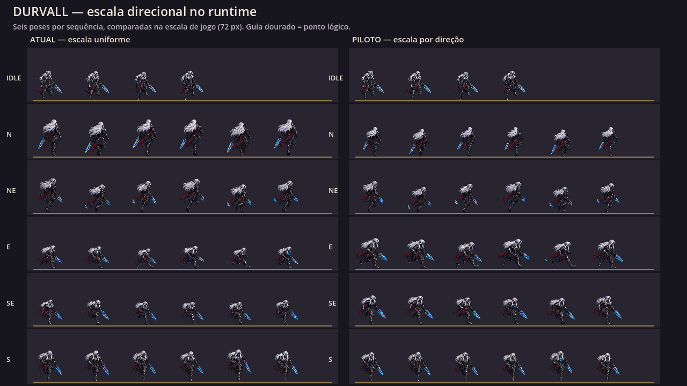
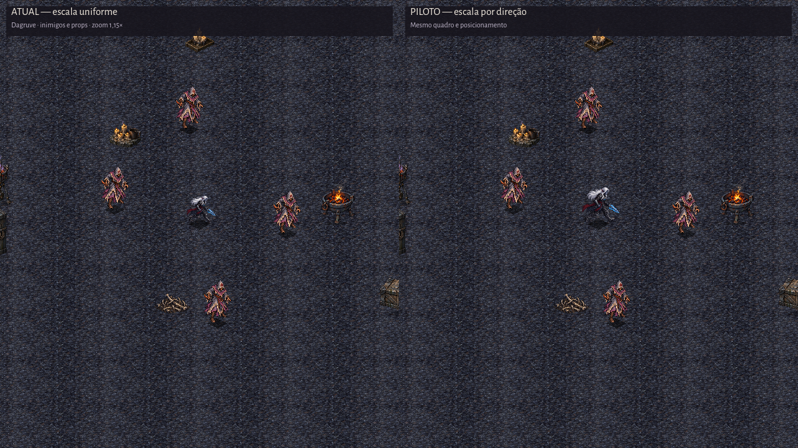

# EVID-132 — Piloto runtime de escala direcional de Durvall

## Tentativa avaliada — perfil revertido

Os fatores abaixo foram ensaiados nas cinco folhas-fonte de movimento de
Durvall, mas não foram aceitos como resultado final:

| Fonte | Fator |
|---|---:|
| `move_n` | 0,796× |
| `move_ne` | 0,918× |
| `move_e` | 1,296× |
| `move_se` | 1,167× |
| `move_s` | 0,951× |

O perfil reduziu a diferença de altura mediana, mas a escala isotrópica também
alterou a largura. Todas as direções e o idle têm largura mediana de alfa de
240 px antes da escala. Após o fator ensaiado, a largura resultante seria
aproximadamente 191 px em norte, 220 em nordeste, 311 em leste, 280 em sudeste
e 228 em sul, contra 240 px em idle. Assim, a pose lateral ficou quase 30% mais
larga. A inspeção do usuário confirmou que Durvall ainda parecia grande de lado.

O ataque não possuía fator próprio: a mediana de sua caixa alfa é 240×284 px,
contra 240×293 px em idle, com base mediana y=376 nas duas folhas. Porém,
começar ataque depois de movimento lateral trocava o fator 1,296× pela escala
base 1× e produzia um salto de tamanho. O ataque ainda varia entre 236 e 294 px
de altura alfa nos quatro quadros, o que exige avaliação da pose inteira, não
só de sua mediana.

A regra de recuperação da SPEC-102 foi aplicada: o perfil e os testes que o
impunham foram removidos e a escala uniforme anterior restaurada. Portanto,
estas capturas são evidência histórica da hipótese reprovada; não representam
o runtime atual. A causa do método foi normalizar apenas altura usando uma
escala uniforme, ignorando largura, silhueta e continuidade na ação.

## Capturas

A comparação contextual usa a cena de Dagruve, os nós visuais do runtime e uma
disposição fixa de quatro inimigos próximos para repetir a leitura. Não é uma
captura de uma batalha prolongada; a prancha cobre os seis quadros por fonte e
a composição contextual confere a pose leste, que recebe o maior aumento,
perto de inimigos e props. Não há captura contextual da sequência de ataque; a
observação dela nesta revisão combina a folha de origem e a escala de runtime.

## Verificações

- Após a reversão: `Godot_v4.7.2-stable_win64.exe --headless --path . -s res://tests/run_all.gd` — exit 0; `testes: 0 falha(s)`.
- Após a reversão: `Godot_v4.7.2-stable_win64.exe --headless --path . res://tools/smoke.tscn` — exit 0; menu e nove fases abriram, com estado `running`.
- As duas cenas gráficas de QA salvaram as capturas e foram inspecionadas.
- Os arquivos em `assets/animations/heroes/` não foram alterados; velocidade,
  posição lógica, colisão e regras de gameplay permanecem iguais.

O ambiente reporta que não consegue gravar `user://logs/godot.log` nem ler a
store de certificados do sistema. Testes e smoke ainda encerraram com exit 0;
Godot também reportou recursos/instâncias residuais ao desligar. Esses avisos
não geraram falhas de teste ou de abertura das cenas.
