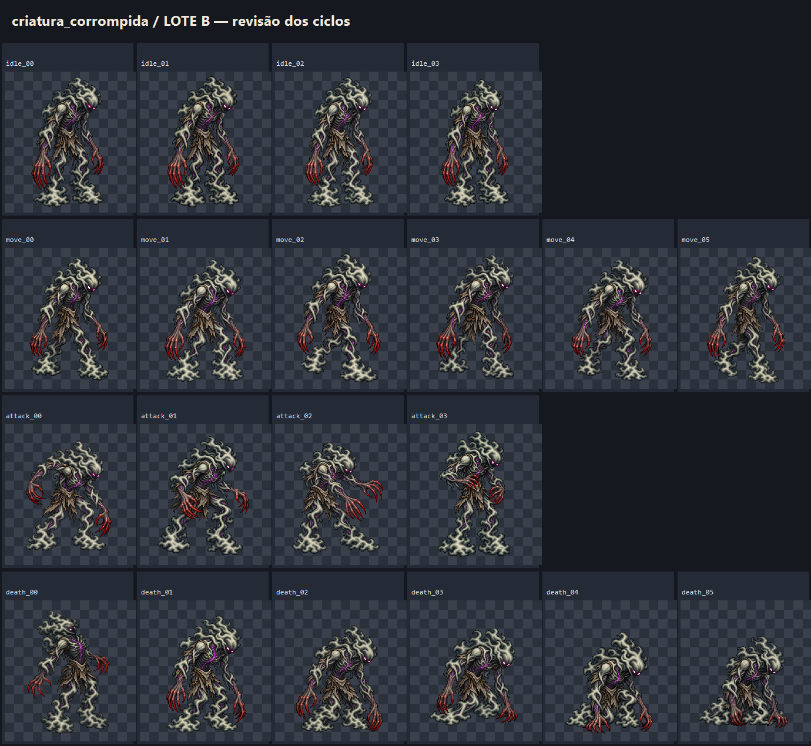
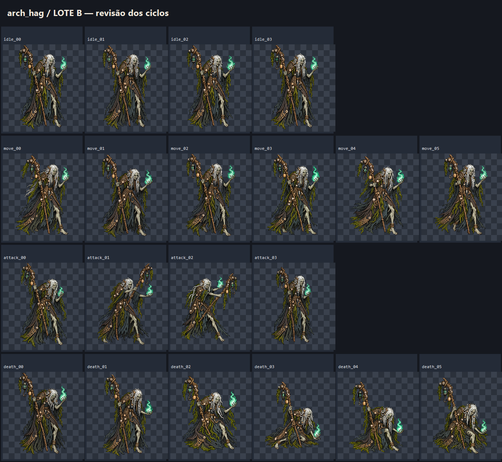

# EVID-133 — Lote B de animações

## Entrega

Foram organizados 20 quadros candidatos para cada mob. Os dois `idle_00` já
aprovados no gate de identidade foram reaproveitados em células nativas; 38
quadros restantes foram gerados individualmente. As imagens finais são PNG RGBA
de 256×384 e permanecem em `.atena/generated/art-candidates/`.

## Pranchas por mob

### Criatura corrompida

### Arch-hag

## QA realizado

- 20 células por mob: 4 idle, 6 move, 4 attack e 6 death; 40 no total.
- Todos os quadros têm 256×384, canal alfa e transparência nos quatro cantos.
- Auditoria de opacidade: pior solidez observada **0,928**, acima do mínimo
  0,90 do plano. A menor alfa médio observada foi 0,948.
- As candidatas são imagens individuais reduzidas de 1024×1536 por
  nearest-neighbor; não foram usados sprite strips.
- Identidades I05 e I06 já tinham aprovação do dono; esta evidência não aprova
  ainda os ciclos de idle, movimento, ataque e morte.
- Nenhum asset oficial, arquivo de runtime, cena, dado ou código foi alterado.

## Decisão do dono

Em 2026-09-30, o dono aprovou os ciclos de `criatura_corrompida` e `arch_hag`.
Eles permanecem candidatos isolados até o gate separado de admissão.
