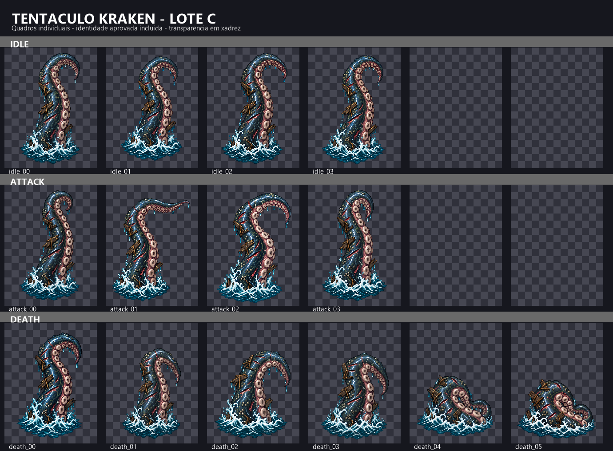
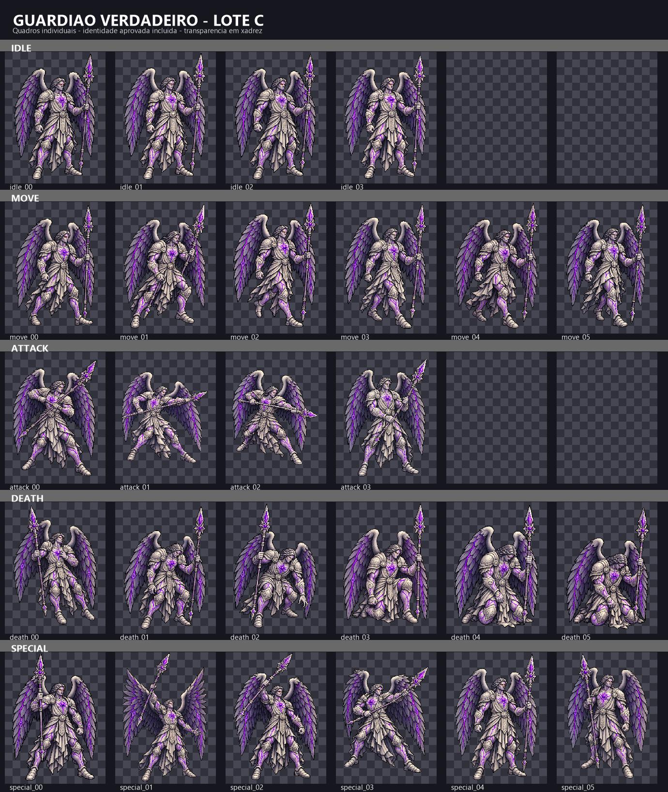

# EVID-134 — Lote C de animações

## Entrega

Foram organizados 14 quadros para `tentaculo_kraken` (perfil C) e 26 para
`guardiao_verdadeiro` (perfil B). Cada ciclo reaproveita o `idle_00` aprovado
no gate de identidade; os outros 38 quadros foram gerados individualmente. Os
quadros finais são PNG RGBA e permanecem isolados em
`.atena/generated/art-candidates/enemies-wave-1/`.

## Pranchas

### Tentáculo-kraken

### Guardião verdadeiro

## QA realizado

- Tentáculo: 14/14 quadros selecionados — 4 idle, 4 attack, 6 death — em
  256×384; solidez mínima 0,966 e alfa médio mínimo 0,971.
- Guardião: 26/26 quadros selecionados — 4 idle, 6 move, 4 attack, 6 death,
  6 special — em 320×480; solidez mínima 0,971 e alfa médio mínimo 0,975.
- Os quatro cantos dos quadros selecionados têm alfa zero; todos superam o
  mínimo de solidez 0,90 do plano. As células foram reduzidas por
  nearest-neighbor de fontes 1024×1536.
- A auditoria recursiva do conjunto encontrou 172 PNGs: 160 quadros finais
  planejados, 8 referências do gate de identidade e 4 versões substituídas
  preservadas para rastreabilidade. A solidez mínima global é 0,928.
- Dois `death_05` v01 foram substituídos por v02 após revisão interna de
  continuidade: as v01 voltavam a uma pose mais ereta que `death_04`. O manifesto
  seleciona as v02 e mantém as v01 como superseded.
- O `.gitignore` existente exclui `.atena/generated/art-candidates/`; por isso,
  os PNGs estão disponíveis localmente para revisão, mas não entram no Git por
  padrão. Não alterei a regra nem fiz staging. A inclusão/versionamento Git
  fica como decisão explícita do dono.
- Nenhum asset oficial, arquivo de runtime, cena, dado ou código do jogo foi
  alterado.

## Decisão do dono

Em 2026-09-30, o dono aprovou os ciclos completos de `tentaculo_kraken` e
`guardiao_verdadeiro`, sem IDs indicados para correção. A aprovação explícita
do ciclo-base do guardião está satisfeita; os dois ciclos ficam como
candidatos aprovados, ainda fora do runtime e pendentes do gate separado de
admissão.

## Proposta de reuso em `guardiao_copia`

O manifesto aponta `guardiao_verdadeiro` como fonte e prevê zero quadros novos.
Porém, a arte estática oficial da cópia usa paleta cinza/dourada e uma lança
curta diagonal, enquanto o verdadeiro usa runas violetas, penas com veios
violeta e uma lança cristalina roxa erguida ([estática da cópia](../../assets/enemies/guardiao_copia.png),
[estática do verdadeiro](../../assets/enemies/guardiao_verdadeiro.png)). Reutilizar
literalmente os 26 PNGs faria a cópia assumir a aparência animada do verdadeiro.

O dono aprovou testar uma variante que reutiliza as poses, não os PNGs do
verdadeiro, para preservar a identidade da cópia. Nenhum quadro foi duplicado
ou adaptado para `guardiao_copia`; nenhum asset oficial foi alterado.

## Próximo voo proposto

Em 2026-09-30, o dono aprovou a recomendação de testar uma variante da cópia
reaproveitando apenas as poses. Foi redigida a [[SPEC-107-piloto-visual-guardiao-copia]],
com três amostras (`idle_00`, `attack_02`, `death_05`) e prompts em
[[ART-PROMPTS-036-piloto-visual-guardiao-copia]]. O dono aprovou a SPEC-107 em
2026-09-30. O dono autorizou a transferência das quatro referências locais ao
ImageGen para este piloto. Os três quadros foram gerados; QA e prancha estão
em [[EVID-135-piloto-guardiao-copia-2026-09-30]]. Em 2026-09-30, o dono
aprovou as três amostras do piloto; a geração das 23 poses restantes ainda
exige autorização separada.
