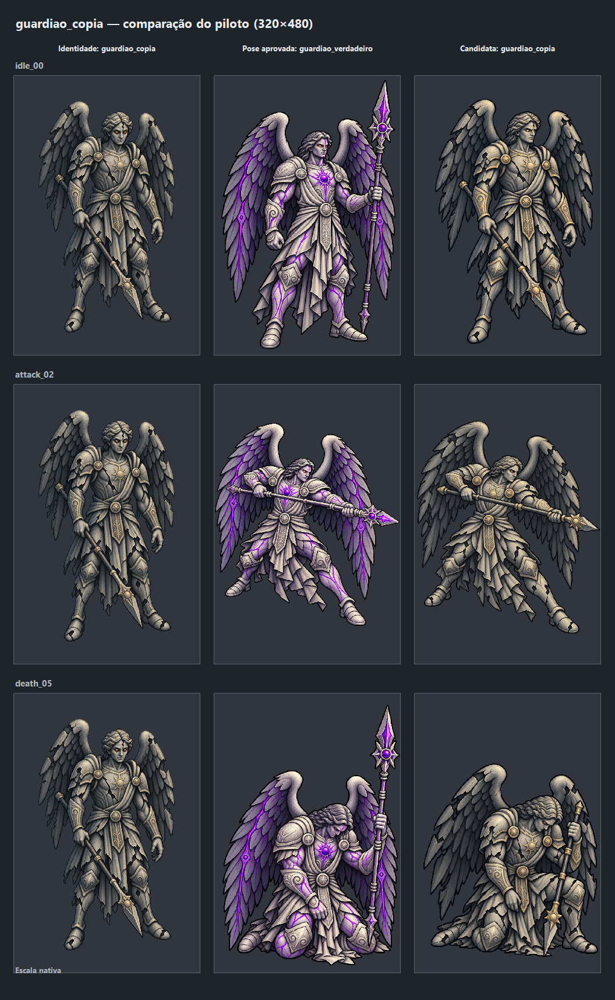
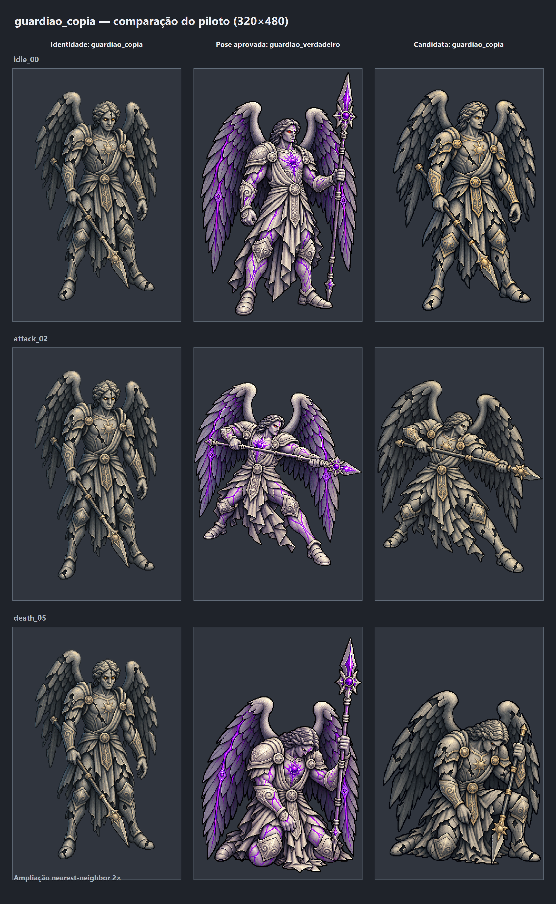
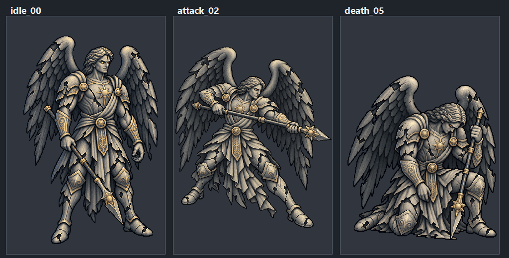

# EVID-135 — Piloto de `guardiao_copia`

## Referências e geração

Em 2026-09-30, o dono autorizou o envio ao ImageGen, exclusivamente para este
piloto, dos quatro PNGs listados na SPEC-107. Cada chamada usou a arte oficial
de `guardiao_copia` como referência de identidade e um único quadro aprovado do
verdadeiro como referência de pose. Os prompts e as restrições completas estão
em [[ART-PROMPTS-036-piloto-visual-guardiao-copia]].

O ImageGen produziu três originais 1024×1536 em RGBA, preservados fora do
projeto em `C:\Users\gui-m\.codex\generated_images\01a0f31e-9118-7ea3-a232-46a18d66d182\`.
As versões candidatas foram reduzidas por nearest-neighbor para 320×480; os
originais do ImageGen e todas as referências continuam sem alteração.
O quadro `idle_00` foi reconstruído do original, reduzido novamente por
nearest-neighbor e deslocado 8 px à direita dentro da célula, preservando o
tamanho e todo o conteúdo opaco; isso deixa margens laterais de 8/12 px, sem
cortar o sprite.

## Comparação visual

Cada linha compara a estática de identidade de `guardiao_copia`, a pose-fonte
aprovada de `guardiao_verdadeiro` e a candidata da cópia. Há uma prancha em
célula nativa e outra ampliada por nearest-neighbor 2×.

## Prancha de candidatas

Ordem da esquerda para a direita: `idle_00`, `attack_02`, `death_05`.

## Saídas e procedência

| Estado | Original do ImageGen | Candidata final | SHA-256 da candidata |
|---|---|---|---|
| `idle_00` | `C:\Users\gui-m\.codex\generated_images\01a0f31e-9118-7ea3-a232-46a18d66d182\exec-919ec306-0b84-444d-bf70-2096c67ceeeb.png` | `.atena/generated/art-candidates/enemies-wave-1/guardiao_copia/pilot/guardiao_copia_idle_00_pilot_v01.png` | `7acaa14221d58565ee4bb92a0376b2cc0c0670047e5fd4c87a9ce17118dc4e53` |
| `attack_02` | `C:\Users\gui-m\.codex\generated_images\01a0f31e-9118-7ea3-a232-46a18d66d182\exec-c17a78be-dfcf-42f7-a5ee-92231bf640b5.png` | `.atena/generated/art-candidates/enemies-wave-1/guardiao_copia/pilot/guardiao_copia_attack_02_pilot_v01.png` | `b786513534782fc5f52a58b651069b3dbe491a82856afc0900018622abd403cd` |
| `death_05` | `C:\Users\gui-m\.codex\generated_images\01a0f31e-9118-7ea3-a232-46a18d66d182\exec-cdb8d7d1-e60c-44d9-8c36-4f2fee0d461b.png` | `.atena/generated/art-candidates/enemies-wave-1/guardiao_copia/pilot/guardiao_copia_death_05_pilot_v01.png` | `e657059d11f5f4922e300cc937ea69d54d1a62b5f4fee8553e523738d0a842d5` |

## QA técnico e revisão pendente

- Os três arquivos finais medem 320×480 e usam `Format32bppArgb`; alfa dos
  quatro cantos é zero em cada arquivo.
- Auditoria `tools/audit_alpha_solidity.gd` no diretório do piloto:
  `attack_02` 0,969 sólido / alfa médio 0,973; `idle_00` 0,971 / 0,974;
  `death_05` 0,980 / 0,979. Solidez mínima 0,969, acima do limite 0,90.
- Margens medidas pela caixa dos pixels com alfa > 0, em pixels:

  | Estado | Dimensão | Alfa médio | Solidez | L/R estática da cópia | L/R pose-fonte | L/R candidata | Topo/base candidata |
  |---|---:|---:|---:|---:|---:|---:|---:|
  | `idle_00` | 320×480 | 0,974 | 0,971 | 38/26 | 10/7 | 8/12 | 35/11 |
  | `attack_02` | 320×480 | 0,973 | 0,969 | 38/26 | 0/0 | 0/0 | 8/33 |
  | `death_05` | 320×480 | 0,979 | 0,980 | 38/26 | 13/0 | 14/4 | 21/6 |

- `idle_00` passou a ter pelo menos 8 px de margem lateral sem perda de pixels.
  `attack_02` ocupa a largura toda também na pose-fonte aprovada (0/0);
  `death_05` tem 4 px à direita, enquanto sua pose-fonte chega à borda direita.
  São casos de enquadramento para o dono avaliar; aumentar a margem pode exigir
  reduzir a escala ou mudar a pose. Por isso os quadros continuam candidatos.
- A auditoria recursiva da Onda 1 contou 175 PNGs (172 anteriores + 3 quadros
  do piloto); a solidez mínima global continua 0,928.
- Em inspeção ampliada e na célula nativa, os três quadros mantêm a leitura
  cinza/prata/dourada da cópia e não trazem os acentos violetas do verdadeiro.
  O ataque estende a lança na horizontal e a morte a posiciona verticalmente.
## Decisão do dono — 2026-09-30

O dono aprovou `idle_00`, `attack_02` e `death_05`. A aprovação cobre apenas
estes três quadros candidatos: não autoriza gerar os outros 23 quadros do
ciclo nem admitir os arquivos no runtime. O ciclo completo aguarda uma decisão
separada.

## Decisão subsequente — 2026-09-30

O dono autorizou a geração das 23 poses restantes, conforme SPEC-108. A
admissão dos arquivos no runtime continua fora de escopo.

## Autorização de transferência — 2026-09-30

O dono autorizou o envio ao ImageGen dos 24 arquivos exatos listados em
ART-PROMPTS-037: a imagem estática de guardiao_copia e as 23 poses nomeadas de
guardiao_verdadeiro. Cada chamada recebe somente a estática e uma pose. Nenhuma
outra referência local foi autorizada por esta decisão.
- Nenhum asset oficial, arquivo de runtime, cena, dado ou código do jogo foi
  alterado. O `.gitignore` segue excluindo a pasta de candidatas; não foi
  alterado nem houve staging.

## Resultado subsequente — 2026-09-30

As 23 poses autorizadas foram geradas como candidatas e passaram no QA técnico.
Veja a prancha, os hashes, a proveniência das fontes e as exceções de margem em
[[EVID-136-ciclo-guardiao-copia-2026-09-30]]. Em 2026-09-30, o dono aprovou
visualmente os 23 quadros novos, completando a aprovação do ciclo de 26. Esta
aprovação não admite os candidatos no runtime.
