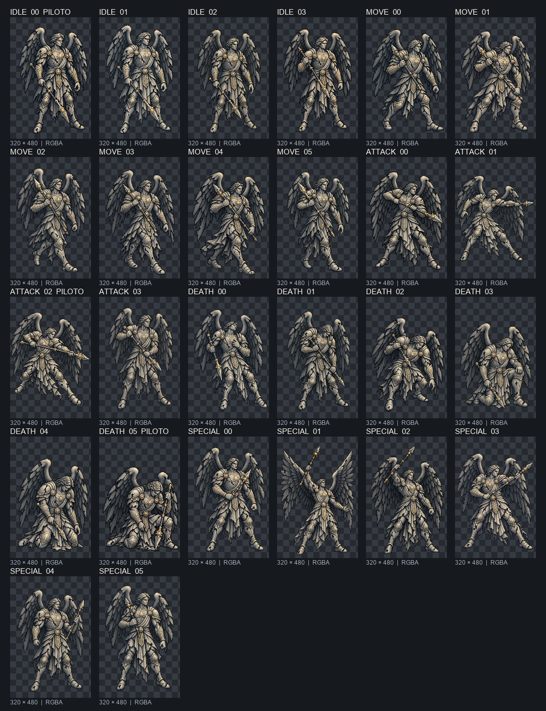

# EVID-136 — Ciclo de `guardiao_copia`

## Resultado

Foram geradas e selecionadas as 23 poses restantes do ciclo. Somadas aos três
quadros aprovados do piloto, o manifesto aponta para os 26 estados completos.
Os candidatos estão isolados em
`.atena/generated/art-candidates/enemies-wave-1/guardiao_copia/`; nenhuma arte
oficial, cena, código, dado de jogo ou asset de runtime foi alterado.

O dono autorizou especificamente 24 referências. Cada uma das 23 chamadas
usou a imagem de identidade `assets/enemies/guardiao_copia.png` e somente a
pose correspondente do `guardiao_verdadeiro`; não foram enviadas outras
referências. As versões brutas selecionadas foram preservadas em `raw/`, e os
derivados finais em `frames/`. Para `idle_01`, `attack_01` e `death_01`, uma
primeira tentativa não selecionada foi substituída por uma nova tentativa com
instrução mais explícita de pose/arma. Tentativas não selecionadas ficaram
fora do pacote local de candidatos.

## Prancha para revisão visual

Cada miniatura está na ordem do manifesto; os três quadros do piloto estão
marcados. O fundo quadriculado representa transparência.

## Quadros gerados e QA técnico

| Estado | Pose-fonte | Candidata final | Solidez |
|---|---|---|---:|
| idle_01 | guardiao_verdadeiro_idle_01_v01.png | guardiao_copia_idle_01_v01.png | 0,9770 |
| idle_02 | guardiao_verdadeiro_idle_02_v01.png | guardiao_copia_idle_02_v01.png | 0,9747 |
| idle_03 | guardiao_verdadeiro_idle_03_v01.png | guardiao_copia_idle_03_v01.png | 0,9760 |
| move_00 | guardiao_verdadeiro_move_00_v01.png | guardiao_copia_move_00_v01.png | 0,9730 |
| move_01 | guardiao_verdadeiro_move_01_v01.png | guardiao_copia_move_01_v01.png | 0,9733 |
| move_02 | guardiao_verdadeiro_move_02_v01.png | guardiao_copia_move_02_v01.png | 0,9742 |
| move_03 | guardiao_verdadeiro_move_03_v01.png | guardiao_copia_move_03_v01.png | 0,9700 |
| move_04 | guardiao_verdadeiro_move_04_v01.png | guardiao_copia_move_04_v01.png | 0,9756 |
| move_05 | guardiao_verdadeiro_move_05_v01.png | guardiao_copia_move_05_v01.png | 0,9686 |
| attack_00 | guardiao_verdadeiro_attack_00_v01.png | guardiao_copia_attack_00_v01.png | 0,9741 |
| attack_01 | guardiao_verdadeiro_attack_01_v01.png | guardiao_copia_attack_01_v01.png | 0,9686 |
| attack_03 | guardiao_verdadeiro_attack_03_v01.png | guardiao_copia_attack_03_v01.png | 0,9697 |
| death_00 | guardiao_verdadeiro_death_00_v01.png | guardiao_copia_death_00_v01.png | 0,9719 |
| death_01 | guardiao_verdadeiro_death_01_v01.png | guardiao_copia_death_01_v01.png | 0,9740 |
| death_02 | guardiao_verdadeiro_death_02_v01.png | guardiao_copia_death_02_v01.png | 0,9705 |
| death_03 | guardiao_verdadeiro_death_03_v01.png | guardiao_copia_death_03_v01.png | 0,9790 |
| death_04 | guardiao_verdadeiro_death_04_v01.png | guardiao_copia_death_04_v01.png | 0,9799 |
| special_00 | guardiao_verdadeiro_special_00_v01.png | guardiao_copia_special_00_v01.png | 0,9726 |
| special_01 | guardiao_verdadeiro_special_01_v01.png | guardiao_copia_special_01_v01.png | 0,9691 |
| special_02 | guardiao_verdadeiro_special_02_v01.png | guardiao_copia_special_02_v01.png | 0,9711 |
| special_03 | guardiao_verdadeiro_special_03_v01.png | guardiao_copia_special_03_v01.png | 0,9702 |
| special_04 | guardiao_verdadeiro_special_04_v01.png | guardiao_copia_special_04_v01.png | 0,9685 |
| special_05 | guardiao_verdadeiro_special_05_v01.png | guardiao_copia_special_05_v01.png | 0,9738 |

O auditor `tools/audit_alpha_solidity.gd` percorreu os 23 derivados. Todos têm
320×480, RGBA, cantos transparentes e solidez acima do mínimo 0,90; o menor
valor exato foi 0,9685 (0,969 arredondado pelo auditor). Os 23 brutos têm
1024×1536 RGBA. O [relatório técnico](EVID-136-ciclo-guardiao-copia-qa-2026-09-30.json)
contém SHA-256 do bruto e do derivado, margens, métricas de alfa e
hashes/dimensões das 24 referências autorizadas. A prancha e o relatório foram
produzidos durante a verificação local de QA; o JSON conserva os metadados para
repetir as conferências de dimensões, alfa e hashes.

Dois quadros têm silhueta visível com menos de 8 px na margem direita,
justificada pela pose e pela arma: `attack_01` (4 px) e `death_00` (5 px).
Nenhuma parte visível está cortada. Algumas franjas de alfa de apenas 1/255
chegam às bordas; ficam abaixo do limiar de visibilidade de 0,04 do auditor e
os quatro cantos permanecem totalmente transparentes.

## Revisão e reconciliação

Triagem preliminar da prancha: escala e paleta cinza/prata/dourada permanecem
coerentes com a cópia, e não se observa o cajado cristalino longo do verdadeiro.
Em 2026-09-30, o dono aprovou visualmente os 23 quadros novos, completando a
aprovação do ciclo de 26 com o piloto já aprovado. Nenhum arquivo foi instalado
ou admitido no runtime; essa aprovação não substitui uma SPEC própria de
admissão. A contagem recursiva da Onda 1 passou de 175 para 221 PNGs ao incluir
23 brutos e 23 derivados selecionados.

## Decisão do dono — 2026-09-30

**Aprovado:** os 23 quadros novos e, portanto, o ciclo candidato completo de 26
quadros. Permanecem em `.atena/generated/art-candidates/`; integração e
admissão no runtime não foram autorizadas por esta decisão.

