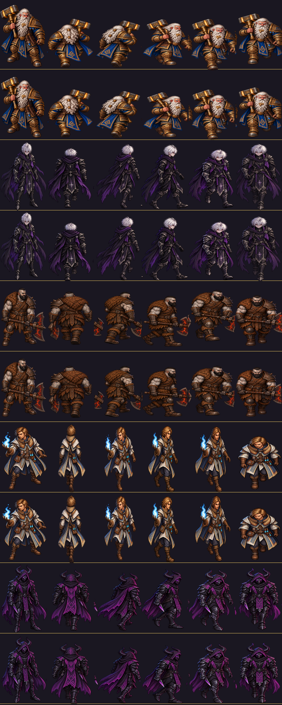

# EVID-140 — Normalização de base e bordas dos heróis (2026-10-01)

SPEC: [[SPEC-112-normalizacao-base-e-bordas-dos-herois]] · Origem: BUG-021 / EVID-139 IN-044.

## Resultado
- 27 tiras regravadas em 5 heróis: Bromnor 5, Kayron 6, Korrak 5, Maelor 5, Sylas 6.
  Brook, Durvall, Leoric, Nyrelia e Zynara não precisaram de alteração.
- `edge_frames`: antes 1–6 em Bromnor, Kayron, Korrak, Maelor e Sylas; **depois 0 em todos os dez heróis**.
- Escala aplicada ≥ 0,977 (redução máxima de 2,3 %).
- Base por herói depois: Korrak 350 em todas; Sylas 376–377; Kayron 371–377; Bromnor 363–369.
- `tests/run_all.gd`: `testes: 0 falha(s)`.

## Pendências (não resolvidas por este passo)
- **Maelor** `move_n` (379) e `move_e` (373) ficam acima de 10 px da base do idle (364): conteúdo alto demais
  para subir sem cortar. Candidato a regeneração.
- **Tamanho entre direções** (o "estica/afina"): inalterado. Brook 245–360, Durvall 226–368, Leoric 215–313.
  Depende do caminho 1 (medir o corpo) ou regeneração.

## Imagem

Ordem: Bromnor, Kayron, Korrak, Maelor, Sylas; colunas idle, n, ne, e, se, s. Linha dourada = base 376.
Os PNGs oficiais mudaram: os hashes de `ASSET-OFFICIAL-LOCK-*` desses 27 arquivos divergem e o lock não foi regerado.
