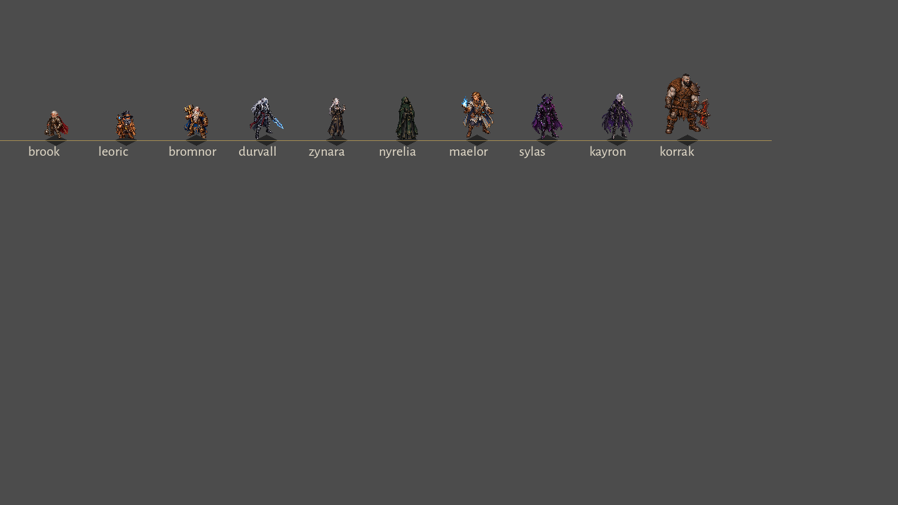

# SPEC-113 — Altura dos heróis por raça

## Problema
O renderer usava a mesma escala (72/384) para todos; a altura em tela era a do alfa do idle
(Brook 49, Leoric 59, Korrak 59, Bromnor 63, Sylas 68, Kayron 70 px). Gnomo ≈ goliath e anão
maior que humanos contrariam o cânone.

## Decisão (dono, 2026-10-01)
Escala **única por herói** no runtime (`ui/hero_view.gd`, `display_scale`), sem alterar PNG.
Humano 1,75 m = 64 px; piso de 40 px para os pequenos.

| Herói | Raça | Tela (px) | Fonte da altura |
|---|---|---:|---|
| Korrak | Goliath | 85 | Vault: ~2,32 m |
| Kayron | Aasimar | 66 | D&D |
| Sylas, Maelor | Tiefling, meio-elfo | 64 | D&D |
| Nyrelia | Humana | 62 | D&D |
| Durvall, Zynara | Drow | 60 | D&D |
| Bromnor | Anão | 48 | D&D |
| Leoric | Gnomo | 40 | Vault: ~1 m (estrito 37) |
| Brook | Halfling | 40 | D&D, hobbit (estrito 35) |

## Limites
- Não corrige a variação de altura **entre direções** (BUG-021, caminho 1); a escala por herói usa o idle.
- Hitbox e coleta são lógicos, não dependem do sprite. Sombra e barra de vida não mudam.
- `HERO_IDLE_ART_HEIGHT` precisa acompanhar a arte: `tests/test_animation_assets.gd` falha se divergir > 3 px.

## Verificação
`tests/run_all.gd`: 0 falhas (inclui `_validate_hero_display_scale`). Fila dos dez heróis no runtime:

